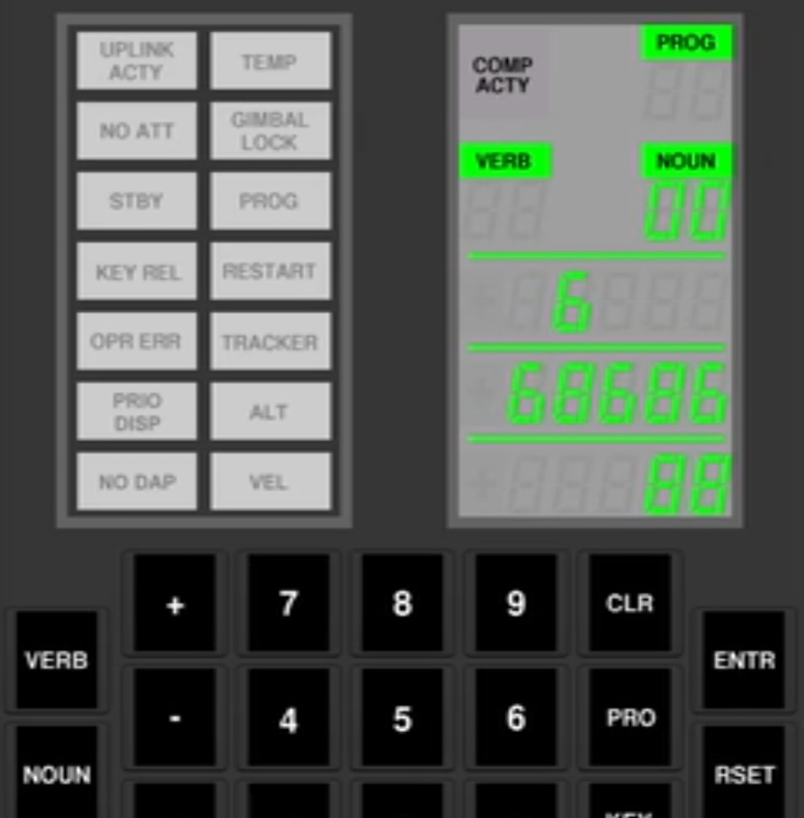

# rev/Launch Sequence

This challenge ran in UIUCTF 2025, and had 0 solves. Because i had gotten quite far by the end of the ctf, i decided to finish solving it even though the ctf had ended (also, there was a bounty on the challenge :P).

The challenge consists of a single file, `main.agc`, part of it is shown below (the entire file is also provided in this repo):
```
Q1tPUP7t
 	CA	1426
 	XCH	1
 	CS	1FpC80Pq
 	AD	1
 	TS	1426
 	CCS	0
 	NOOP
 	TCF	Dr39aHxl
 	TCF	y4rDa074
Dr39aHxl
 	EXTEND
 	READ	15
 	XCH	1
 	CS	UgwNAPxy
 	AD	1
 	EXTEND
 	BZF	entl2lN5
y4rDa074
 	CA	nNhLrhEp
 	TS	1422
 	CA	1423
 	AD	1FpC80Pq
 	XCH	1
 	CA	0FnnSWCT
 	TS	1427
 	CA	7
 	EXTEND
 	DV	1427
 	LXCH	1426
```
Along with a description of:
```
All systems ready for launch, captain. You just need to input the passcode.
What do you mean you lost it? Wait, are you playing games?? How did you even get that on here???
Flag format is uiuctf{<numbers after countdown>} e.g. uiuctf{0123456789}
```

Clearly, the file is some kindof assembly code. Googling "AGC assembly" leads to here: https://www.ibiblio.org/apollo/assembly_language_manual.html#gsc.tab=0

So this seems to be assembly for the Apollo guidance computer (quite fitting for the space theme!). Luckily for us, the website provides good documentation of the the architecture, along with providing tools to run and debug the code!


# Quick AGC architecture overview

The architecture is relatively simple, but it contains a few oddities. The main one being that AGC is a 15-bit system - all registers and memory locations are 15 bits wide, with the exception of the accumulator register, which contains an extra bit for overflow (similar to the carry bit of the flags register in x86)

It also doesn't use two's complement to represent negative numbers like most CPUs do today, instead using one's complement - this means that negative numbers are the binary `NOT` of their positive counterparts. A side effect of this is the existence of two distinct "zeroes", +0 and -0, the first being `0x0000` and the latter being `0x7FFF`.

The memory of the AGC is split into two parts; the lower is read/write (also called "earasable" in AGC terms) and the higher is read-only (also called "fixed" in AGC terms). One part of memory in both regions (earasable and fixed) can have several "banks" swapped in and out, and the rest is hardwired to banks 1 and 2. However, one can also load bank 1 or 2 into the swappable region, effectively giving each memory location in that bank two addresses - one in the unswappable region, and one in the swappable region. This trick threw me off for a bit, luckily it is only used twice in the code so it didn't throw me off completely, and i quickly realised what the issue was.


# Running the code

At the start, i mentioned some tools for running and debugging AGC code. The website provides both the source code for manual compilation, and a pre-made VM with compiled versions. I tried both, but i couldn't get the VM version to work, so i resorted to compiling from source (along with needing to compile a dependency, wxWidgets, too).
It took me several attempts to figure out how to correctly execute the program, but what worked for me in the end was:
 1. assemble using `yaYUL main.agc`
 2. run using `yaAGC --no-resume main.agc.bin`. The `--no-resume` flag prevents `yaAGC` from loading a core file created in previous runs.
 3. connect the keypad display using `../bin/yaDSKY` while in the `Resources` directory. Also, make sure that only one instance of `yaAGC` is running, else `yaDSKY` will connect to the wrong one.

Finally running the code, we see that it is... *drumroll please*... Tetris!

The display is slightly confusing at first, encoding two blocks into each 7 segment number using 9, 6 or 8 depending on whether the "higher" or "lower" or both blocks are present, respectively.
We can move the falling block using 4 and 6 on the keypad, aswell as rotating by 90, 180 and 270 degrees using keys 2, 5 and 8.


# Decompilation

Alright, let's finally have a proper look at the assembly code. At the very start, we have a `SETLOC 4000` pseudo-instruction, which places the code at the start of the fixed memory region. We then have lots of code with obfuscated labels and at the very end there are lots of labels to data constants (mostly numbers, and some tables and a few function addresses). I made a short script to replace all labels to numeric constants with `CONST_<number>`, to make things more readable.
At the top, we have what looks like some sort of jump table, and the documentation tells us that this location (04000) should contain the interrupt table. Whenever the AGC recieves an interrupt, like a timer overflowing or a key press, it jumps to the appropriate place in the interrupt table, where execution continues until it hits the `RESUME` instruction, where it will return to the position before the interrupt.
Most interrupts in our table immediately return with the `RESUME` instruction, but a few (specifically, the timer 3, timer 4, timer 6 and key press interrupts) jump to a different part of the program.
Address 04000 itself is also the entry point, which jumps to an initialisation function - it clears some memory values (but not nearly enough to properly reset...) and then stalls in an infinite loop.

I started by only annotating the assembly code, but that quickly became too chaotic and i decided to decompile it into C pseudo code instead. This ended up being much better, since i could compress a long, confusing chunk of assembly into a few clear and concise lines of C. Armed with this aproach and the knowledge that i was decompiling tetris, i was soon looking at the complete decompiled code.

I found the interesting parts that you wouldn't find in a normal tetris implementation - firstly, for each piece that was placed on the board, its rotation and X position was recorded, encoded and packed into an array starting at `01454` that i named `flag`.
When a game over state was detected, instead of immediately stoping, a series of `if`s was conducted (this is my decompiled code):
```
if (internal_board[0] != 23) goto GAME_OVER;
if (internal_board[1] != 30) goto GAME_OVER; 
if (internal_board[2] != 35) goto GAME_OVER;
if (internal_board[3] != 31) goto GAME_OVER;
if (internal_board[4] != 60) goto GAME_OVER;

if ((flag[5] & 31) != 19) goto GAME_OVER; // 15th piece
if ((flag[7] & 31) != 4) goto GAME_OVER; // 21st piece
if ((flag[9] & 7) != 3) goto GAME_OVER; // 27th piece

if (rng_counter != 33) goto GAME_OVER;
start_countdown() // <- this is what we want
```
If all the conditions were met, the countdown will start and `flag` will be printed to the display.

So our goal is to find a series of moves that satisfies these conditions and then trigger a game over state. This meand that we must end with the following board state:
```
-------
| ## #|
| ####|
|## ##|
|## # |
|## ##|
|# #  |
-------
```
And we must place the 15th, 21st and 27th pieces in certain positions/rotations (remember that `flag` encodes the position and rotation of dropped pieces), as well as having ran the prng a total of 33 times.
The prng is used for generating the sequence of piece types - since the initial state of the prng is hardcoded, we can easily emulate it to find the sequence of piece types that will appear - it ends up being 30 pieces long, since the prng might run multiple times per piece.


# Finding the correct sequence of moves

Now we are left with the "simple" task of finding the correct sequence of moves to arrive at the required board state.

My first idea was to simply brute force every possible sequence of moves - however, some quick math showed that there were too many options to search through, even when some sequences ended early because of game over states.

The key is to realise that many different sequences of moves will converge to the same board state, so we can ignore all board states that we have already seen.

I decide to write the search in cpp, but instead of showing you my terribly messy code, i will simply describe it in (almost) equivalent pseudocode:
```
previous_states = [EMPTY_BOARD]
return_paths = list of lists of lists

for step, piece in piece_order:
    next_states = set()
    for next_board in possible_placements(board, piece):
        next_states.append(next_board)
        return_paths[step][next_board].add(board)
    previous_states = next_states

print(walk_back(return_paths, target_state))
```
The`return_paths` variable keeps track of which board states lead to which next state, allowing me to quickly extract the sequence of board states leading to the target state.

The difficult part to program is the `possible_placements` function. With the advantage of hindsight, i would probably implement it like this, using a BFS search:
```
def possible_statements(board, piece):
    piece_pos = (start_pos, start_rot)
    if not valid_pos(board, piece, start_pos) return []
    valid_positions = [start_pos]
    for i=0; i<len(valid_positions); i++:
         for next_pos in possible_moves(valid_positions[i]):
             if not valid_pos(board, piece, next_pos) or next_pos in valid_positions: continue
             valid_positions.append(next_pos)
    return [apply(board, piece, pos) for pos in valid_positions if is_grounded(board, piece, pos)]
```
This is slightly more work, but is guaranteed to always be correct. What i used instead was simpler, and worked *most* of the time, which happened to be good enough to find a solution; i would simply try all of the rotations and x positions the given piece could be in, and then check that there were no blocks anywhere above the piece. This approach created many false negatives and even a few false positives, most of which i fixed manually.

And that's all! We have the correct sequence, and we can input it into `yaAGC` (if you do this, i recommend patching the assembly to remove automatic piece dropping and replace it with a keypress), or you can just calculate the flag yourself, because we know the flag encoding scheme.

